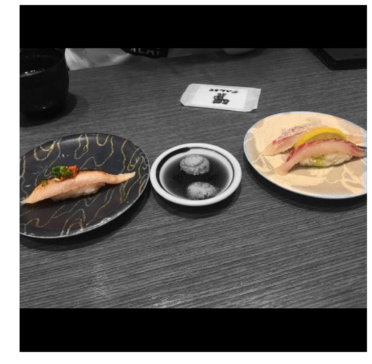
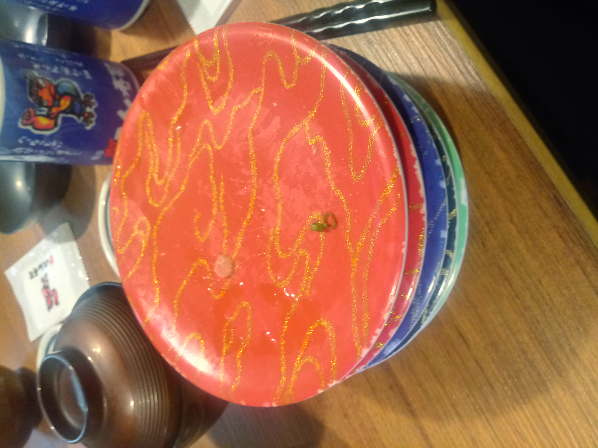
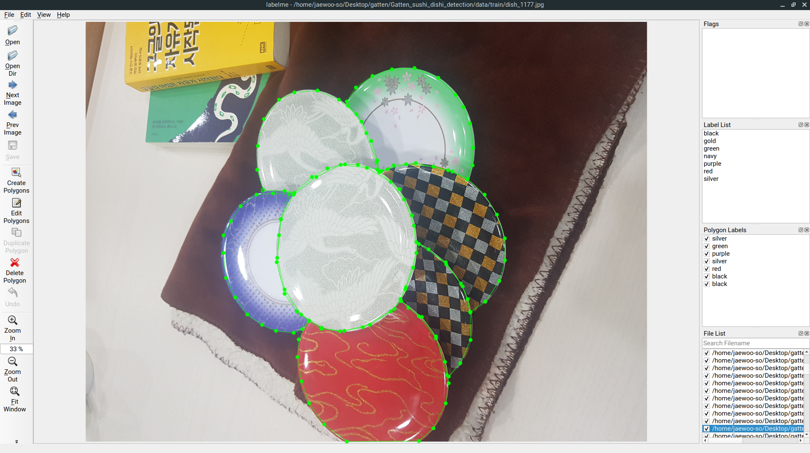
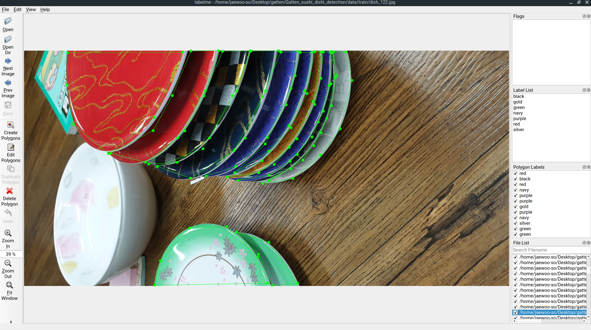
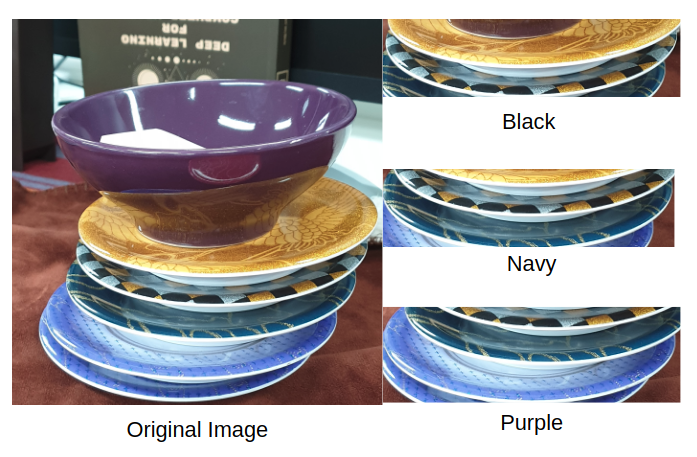
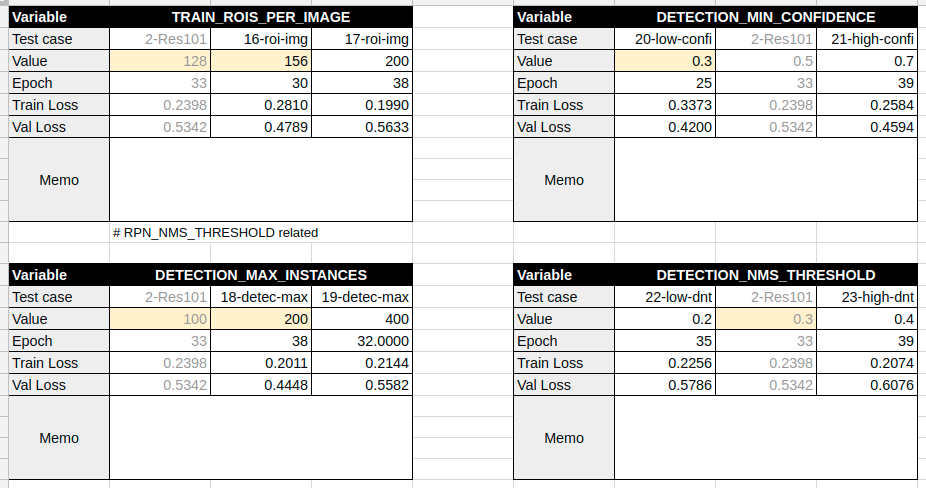
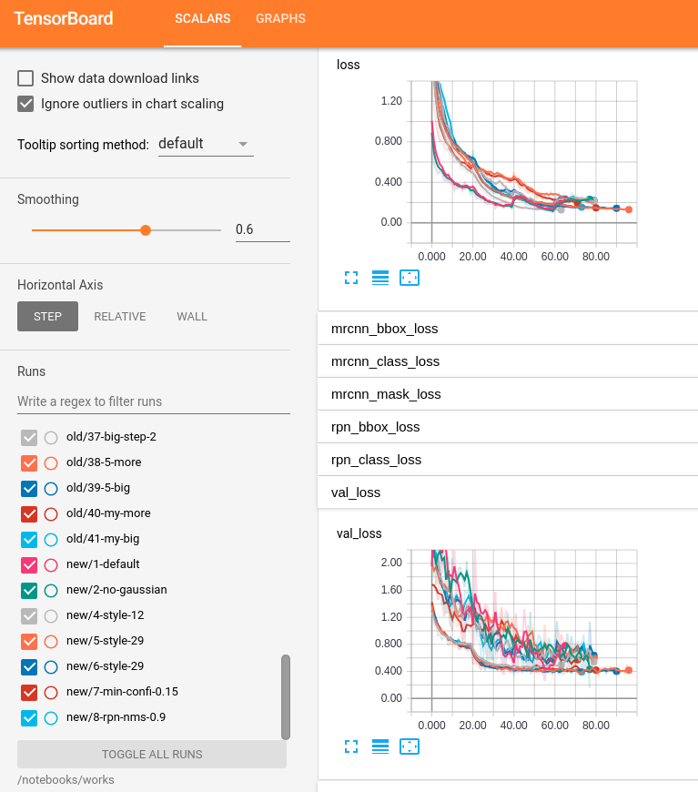
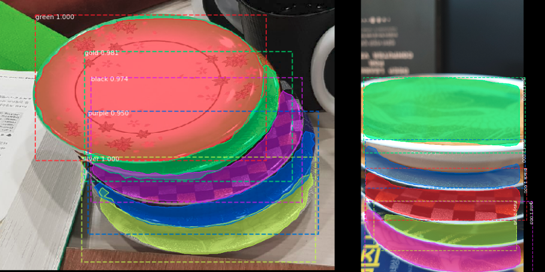
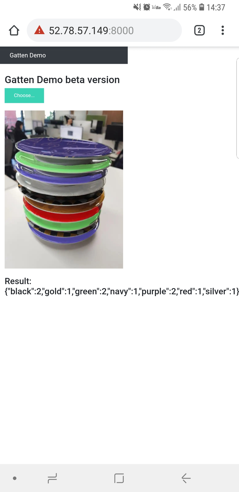

# Mask-RCNN Sushi Dish Detection

<p align="center">
    
</p>

> Implement a color splash effect on dish detection.

## Introduction

The following is a summary of the "Sushi Dish Detection Project" in October 2018. If there is a mistake or a better way, please let us know by e-mail(info@blackrubystudio.com) or Github. We also hope that this summary will give some hints to others who are learning deep learning just like we do.

At the Korean branch of the Gatten Sushi(belt sushi restaurant), there was a suggestion to make a program that can easily measure the price of the sushi dishes that customers have eaten. At that time, we did not know that this was possible in reality, because dishes were piled up so that there would not be many exposed parts. Also, it has a direct impact on price, there can be a mistake that customers are overcharged or under-charged.

<p align="center">
    
</p>

We have achieved the desired goal, but unfortunately we have can not contact the company any more, so we want to organize the project and applied to [bread price measurement](https://github.com/blackrubystudio/bread-scanner).

## Steps

### 1. Gather and Label Pictures

Before the dish arrives, we went to Gatten restaurant and took 50 pictures of dishes, and collected about 100 pictures from Google (Most of the pictures from the internet are heavily filtered and later exclude them from all training). As a simple toy project, 150 images showed sufficient accuracy.

#### 1a. Gather images from google

[Google Images Download](https://github.com/hardikvasa/google-images-download)

With above open source, we can easily search and download Google images to the local hard disk.

#### 1b. Gather images by ourself

After the dish arrived, we took pictures in various ways. We continuously added pictures to improve accuracy, and took about 1700 pictures at the end of the project.

#### 1c. Shuffle images *

We put all the images in one folder, use simple python code to sequence all the images in the folder, then reset them to a specific name.

```bash
python3 shuffle_images.py --dataset ${PWD}/data/train
```

#### 1d. Resize images *

When we first started, we compressed all the images for quick training. After that, we used only the original image to vary the image size in various ways. ([Image resize code we refer to](https://github.com/EdjeElectronics/TensorFlow-Object-Detection-API-Tutorial-Train-Multiple-Objects-Windows-10/blob/master/resizer.py))

#### 1e. Image Labeling

The most difficult step. We made labels on the image to train. Inside the team, we used [Labelme](https://github.com/wkentaro/labelme), which has many shortcut keys. When we asked our friends for image labeling, we asked them to use [Via](https://www.robots.ox.ac.uk/~vgg/software/via/), which does not require installation.

```bash
## Recommended labelme config, autosave & nodata
labelme --autosave --nodata
```

<p align="center">
    
    
</p>

> Labelme screenshot. (To take a variety of pictures in the same place, we used blankets and books with a colored cover. We also included other common dishes to test our program)

#### 1f. Synthetic Data *

We were tired of manually labeling, we found this by accident. Synthetic Data is a method to randomly generate fake data and to automatically extract the labeling. We were planning to use Unity to place 3d modeled dishes at random, but could not find any way to extract the labeling data. We decided to look it out when the project was over, but we did not figure it out yet. ([Wired article about synthetic data](https://www.wired.com/story/some-startups-use-fake-data-to-train-ai/))

### 2. Set up Trainning Environment

In most cases we used "Deep learning AMI" in AWS. We did not ask AWS for releasing the number limit of GPU, so we were forced to make one single instance in various regions.

#### 2a. AWS p2 vs p3

We compared the two instances and found that p3 was the best fit for our situation.

Instance | GPU | GIB | Price | CPU times | Sys times | Wall time | Total time(s) | Total price(s)
-----|-----|-----|-----|-----|-----|-----|-----|-----|
p2.xlarge | 1 | 4 | 0.9 | 13min 13s | 3min 45s | 16min 58s | 1018 | 0.436043
p3.2xlarge | 1 | 16 | 3.06 | 4min 8s | 1min 4s | 5min 13s | 313 | 0.455849

#### 2a. Default Setting

```bash
# sudo locale-gen ko_KR.UTF-8
sudo apt-get install tmux unzip
source activate tensorflow_p36
pip install --upgrade pip
```

#### 2b. Set up for Tensorflow *

```bash
conda install pillow
## if you don't want to see scipy warning, better use 0.13.0
pip3 install -U scikit-image==0.13.0 cython

## if you need pycocotool
pip3 install "git+https://github.com/philferriere/cocoapi.git#egg=pycocotools&subdirectory=PythonAPI"
```

#### 2c. Set up for Mask RCNN *

```bash
pip install imgaug opencv-python
```

#### 2d. Local Setting for checking

We used the tensorflow docker, not installing Tensorflow-GPU locally, because it's enough to simply check the training results. If you are not using gpu locally, please use other version of [tensorflow docker in docker hub](https://hub.docker.com/r/tensorflow/tensorflow/tags/).

```bash
nvidia-docker run -d -p 8888:8888 -p 6006:6006 -e PASSWORD=1111 --name mask_rcnn -v ${PWD}:/notebooks/works tensorflow/tensorflow:latest-gpu-py3
nvidia-docker exec -it mask_rcnn bash

(docker) $ apt-get install -y libsm6 libxext6 libxrender-dev
(docker) $ pip install scikit-image==0.13.1 imgaug opencv-python
```

#### 2e. Inspect Data *

We used `Inspect.ipynb` in [Mask R-CNN](https://github.com/matterport/Mask_RCNN) to check annotations.

### 3. Search Models

At first, we would like to use Tensorflow Lite, which can run a deep running model on mobile.

#### 3a. Deep Learning model on mobile

- SSD: Real-time hand detector with web cam, it is said to have an fps between 11 and 21, we thought it was unsuitable for the mobile environment. ([SSD-on-tensorflow](https://towardsdatascience.com/how-to-build-a-real-time-hand-detector-using-neural-networks-ssd-on-tensorflow-d6bac0e4b2ce))
- Tiny Yolo: We wanted to find out excellent performance based on the performance table but there was not many actual example.
- Squeeze Net: In Tensorflow Lite, it need 224ms to calculate, Top-1 accuracy is 49.0%, Top-5 accuracy is 72.9%. [Squeeze Net data](https://github.com/tensorflow/tensorflow/blob/master/tensorflow/contrib/lite/g3doc/models.md)
- Pelee: Optimized for mobile deep running. It has slightly better than Tiny YOLOv2 and SSD + MobileNet, but it is based on the Caffe framework. There is also a Tensorflow version, but only classification is available.
- MobileNetv2: It is based on TensorFlow. In TensorFlow Lite, it need 637ms to calculate one image, Top-1 accuracy is 70.8%, Top-5 accuracy is 89.9%. (Same data as Squeeze Net)

We thought Squeeze Net is the most suitable model for the current project. However we selected MobileNetV2 as the documenting level.

We trained MobileNetV2 with about 300 images, and "mIOU 50% accuracy" is about 20%. We suspected that we made a mistake in read data, but we changed to the pixel-wise model, because we thought there was a problem with the box while looking at the trained data.

<p align="center">
    
</p>

> We saw that there was only small difference when we cut it by each part and thought that it would be difficult to distinguish objects by squares.

#### 3b. Instance Segmentation

We chose [Mask RCNN](https://github.com/matterport/Mask_RCNN), which is well documented and has lots of examples.

### 4. Prepare for trainning

#### 4a. Label map

```python
## in dish.py

self.add_class("dish", 1, "green")
self.add_class("dish", 2, "red")
self.add_class("dish", 3, "purple")
self.add_class("dish", 4, "navy")
self.add_class("dish", 5, "silver")
self.add_class("dish", 6, "gold")
self.add_class("dish", 7, "black")
```

#### 4b. Load Images

After converting the data format of Via to LabelImg(`via_to_labelme_form.py`), the data of LabelImg is loaded from Mask RCNN.

```python
## load from Mask RCNN in dish.py

# Train or validation dataset?
assert subset in ["train", "val"]
dataset_dir = os.path.join(dataset_dir, subset)

# get all images that end with '.jpg'
image_list = [x for x in os.listdir(dataset_dir) if x.endswith('.jpg')]

# Load annotations and Add images
# LabelImg Annotator saves each image in the form:
# { 'flags': {},
#   'shapes': [
#     {
#       'label': 'string',
#       'points': 
#       [
#         [
#           y0, x0
#         ],
#         [
#           y1, x1
#         ],
#         ...
#       ]
#     },
#     ... more regions ...
#   ],
#   'imagePath': '/path/to/img'
# }
# (left top is (0, 0))
for image in image_list:
    image_name = image.split('.jpg')[0]

    # get image size and annotation
    image_path = os.path.join(dataset_dir, image)
    image = skimage.io.imread(image_path)
    height, width = image.shape[:2]
    annotation = json.load(open(os.path.join(dataset_dir, image_name + '.json')))

    self.add_image(
        'dish',
        image_id=image_name,
        path=image_path,
        width=width, height=height,
        shapes=annotation['shapes']
    )
```

### 5. Run the Training

#### 5a. Finally start trainning

```bash
export SERVER_NAME=virginia-dl ## or SERVER_NAME=ubuntu@ip-address
## copy files to server (dish data, pre trainned h5 file)
scp -r dish_server/* ${SERVER_NAME}:/home/ubuntu
ssh ${SERVER_NAME}

(server) > tmux new -s train
(server - tmux) > source activate tensorflow_p36
(server - tmux) > python3 dish.py train --dataset=${PWD}/path/to/data --weights=coco
```

#### 5b. Configure training

We did not see the desired result with first few training. So we decided to increase the accuracy by changing config variable.

Then we read everything from Fast RCNN to the feature pyramid and Mask RCNN paper, but we have not got any hint about setting the variable, although we have a slightly better understanding of the model. We looked through serveral sources from Google, but unfortunately it did not match our case.

In order to set config more precisely, we set a certain learning range and then find the optimal variable value by raising or lowering the value little by little. We think about it now, we have done the manual gridsearch and regret that we could do it automatically.

<p align="center">
    
</p>

> In this case set, 2-Res101 is default case. We choose only the best case when compared to the basic case, and then combine each variable and continue to continue...

### 5e. Check result in Tensorboard (local) *

```bash
nvidia-docker run -d -p 8889:8888 -p 6007:6006 -e PASSWORD=1111 --name board -v ${PWD}:/notebooks/works tensorflow/tensorflow:latest-gpu-py3

(docker) > tensorboard --logdir=${PWD}/works
```

<p align="center">
    
</p>

## Result

We did training in various ways, but accuracy seems to be low when more than 10 plates were stacked. We did not have any photos of the trained data that were stacked with more than 8 dishes. We think accuracy can be improved by adding those pictures, but we think that is a simple labor work, we did not add it. In the end, we made a simple website and tested it on mobile and finish the project. ([Also we added the code to calculate accuracy in other project](https://github.com/blackrubystudio/bread-scanner).)

<p align="center">
    
</p>

<p align="center">
    
</p>

## Resources

- [Mask RCNN](https://github.com/matterport/Mask_RCNN)
- [Deep lab](https://github.com/tensorflow/models/tree/master/research/deeplab)
- [Cousera Convolutional Neural Network](https://www.coursera.org/learn/convolutional-neural-networks)
- [Tensorflow object detection tutorial](https://github.com/EdjeElectronics/TensorFlow-Object-Detection-API-Tutorial-Train-Multiple-Objects-Windows-10)
